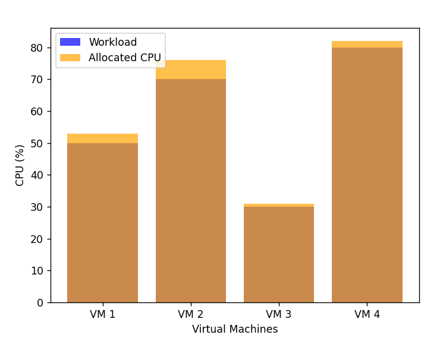

# 🧠 Cloud Resource Optimization Using TLBO Algorithm

Optimizing cloud resources is a critical task in managing modern applications. This project demonstrates how to use the Teaching-Learning-Based Optimization (TLBO) algorithm to optimize CPU resource allocation for virtual machines in a cloud environment, ensuring cost efficiency and performance.


## 🚀 Features

* Optimization Algorithm: Implements the TLBO algorithm for resource optimization.
* Real-World Use Case: Focuses on CPU allocation in cloud environments with latency constraints.
* Easy to Extend: Modular code structure for custom optimization scenarios.
* Visualization: Graphical insights into resource allocation and workloads.
* Comprehensive Testing: Unit tests for all core functionalities.


## 🛠️ Project Structure

```bash
cloud-resource-optimization-tlbo/
├── src/
│   ├── tlbo.py                # TLBO Algorithm implementation
│   ├── problem_definition.py  # Defines the optimization problem
│   ├── utils.py               # Helper functions
├── tests/
│   ├── test_tlbo.py           # Unit tests for the TLBO class
│   ├── test_utils.py          # Tests for utility functions
│   ├── test_validation.py     # Validation tests for workloads and constraints
├── data/
│   └── vm_workloads.json      # Example VM workloads (optional)
├── notebooks/
│   └── visualization.ipynb    # Jupyter notebook for visualization
├── requirements.txt           # Python dependencies
├── README.md                  # Project documentation
└── LICENSE                    # License file
```


## 🧑‍💻 Getting Started

### Prerequisites

* Python 3.8+
* Pipenv or a similar dependency manager

### Installation

Clone the repository:

```bash
git clone https://github.com/your-username/cloud-resource-optimization-tlbo.git
cd cloud-resource-optimization-tlbo
```

Install dependencies:

```bash
pip install -r requirements.txt
```

## ⚙️ Usage

### Running the Optimization

1. Define your VM workloads in src/problem_definition.py.
2. Run the main script to execute the TLBO algorithm:
```bash
python main.py
```

## 📊 Example Results



## 🔍 How It Works

1. Input: VM workloads and constraints.
2. TLBO Algorithm:
    * Teacher Phase: The best solution (teacher) improves the mean performance.
    * Learner Phase: Solutions are refined through pairwise interactions.
3. Output: Optimal CPU allocations that minimize cost and satisfy latency requirements.

## 🧪 Running Tests

To ensure everything works as expected:

```bash
python -m unittest discover -s tests
```

## 🤝 Contributing

I welcome contributions! To get started:

1. Fork the repository.
2. Create a new branch for your feature:
```bash
git checkout -b feature-name
```
3. Commit your changes and push:
```bash
git push origin feature-name
```
4. Open a pull request.

## 🛡️ Acknowledgments
* Inspired by the TLBO algorithm in optimization.
* Special thanks to the open-source community for tools and libraries.

## 🌟 Support
If you found this project useful, please ⭐ the repository and share it with your peers!